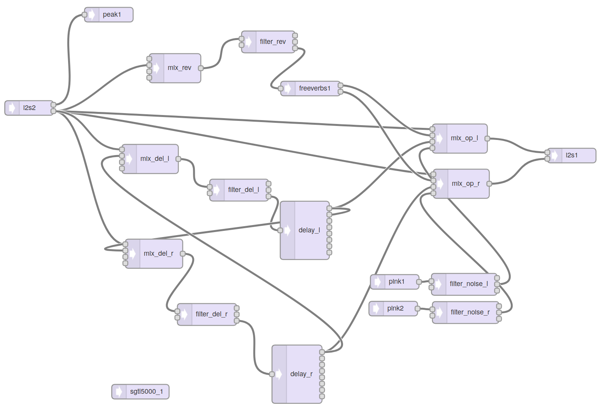
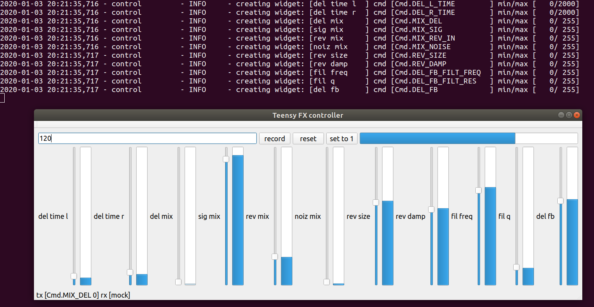

# Teensy FX

* A [Teensy 4](https://www.pjrc.com/teensy-4-0/) based FX unit with [Pocket Operator](https://teenage.engineering/products/po) style and playability.
* 12 knobs, 4 buttons each with LED, and 4 LEDs showing automation cycle.
* Combination of filtered reverb, ping pong filtered delay and a noise source, but this is [customisable](#Audio-patch).
* Each knob can be automated (a bit like punch in effects on the Pocket Operators)
* Tap tempo and PO sync
* [video series on development and use of the teensy-fx](https://www.youtube.com/playlist?list=PLmcDgdDpcaPg4DthWWuq7HqhB-hiN_gUg)

# Hardware

[schematic](hardware/schematic.pdf)

[gerbers](hardware/teensy-fx-2020-02-10-fab.zip)

[photos](https://photos.app.goo.gl/ELiSmwA5KhBPN7PL9)

[noise performance](docs/noise.md)

Buy the right parts through the links on the [kitspace page](https://kitspace.org/boards/github.com/mattvenn/teensy-audio-fx).

## Hardware Resources

Based off the teensy 4 audio board and the [teensy beats shield](https://hackaday.io/project/161127-teensy-beats-shield)

* teensy 4 audio board schematic https://www.pjrc.com/store/schematic_audio4.png
* [SGTL5000 datasheet](https://static6.arrow.com/aropdfconversion/d5e3ddfdb01ac7d0ee29dd23626c23e0eb18a14a/1931605559406471sgtl5000.pdf)
* TLC5947 24 channel PWM LED driver
* 4067 multiplexer for the knobs
* pot RK09K1130AP5

## Hardware V1: git commit 99c1038

check the git repo out to the [hash](https://github.com/mattvenn/teensy-audio-fx/tree/99c1038) to make sure everything is in sync.

### Errata

* Do not place C16
* Swap LRCLK & BCLK - see pic [lrclk-bclk-swap](docs/lrclk-bclk-swap.png)
* 2.2uF ceramics sound as good and are much cheaper than the 1uF acrylics for C8, C9, C14 & C15

## Hardware V2: git master

* test points for mic input
* separate regulator for pot 3.3v to reduce noise?
* put leds and buttons below pots for easier viewing and pressing
* leave space on back for rubber feet
* update FP of audio sockets to new FP - audio sockets weren't available in EU, changed to 35RASMT2BHNTRX which has 5 pads but will fit on the same fp
* filter behind pot mux was a mistake. filters must be in front of mux or removed - fixed by removing
* fix LRCLK & BCLK mixup - fixed

## Back graphic

* Art by Kipling: http://bit.ly/39Wxc4R. Designed in ContextFree
* 100 x 60mm == 3.94 x 2.36" == 1182 x 708 pix

# FW

* each knob controls one of the parameters
* each knob has a number of steps of recordable automation
* knob's leds brightness shows current value of parameter
* record time is based on bpm tap tempo and number of steps (4 bars in control.py)
* buttons are: tap tempo/sync, write, erase and start automation loop from beginning
* press & hold tempo button to switch between tap tempo and [PO sync mode](docs/PO_sync_mode.md)
* press write and move a knob to record its movement
* moving a knob without pressing record will wipe the pattern and set it all to the current knob value
* 4 leds on top right show progression through the automation loop
* freeverb [noise issue](https://forum.pjrc.com/threads/57046-Freeverb-with-low-input-levels-gt-noise-and-wierd-oscillating-quot-tone-quot) fixed [here](https://github.com/PaulStoffregen/Audio/pull/357)

# Audio patch

made with https://www.pjrc.com/teensy/gui/index.html

# Software

[control.py](control.py) is a PyQT program that was developed in order to make an MVP
interface that could later be translated to hardware in the form of a PCB.

