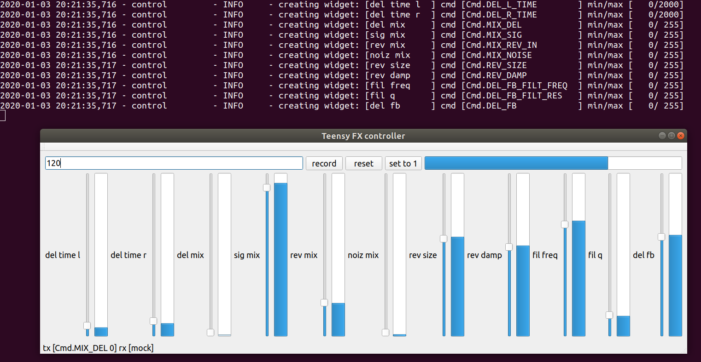
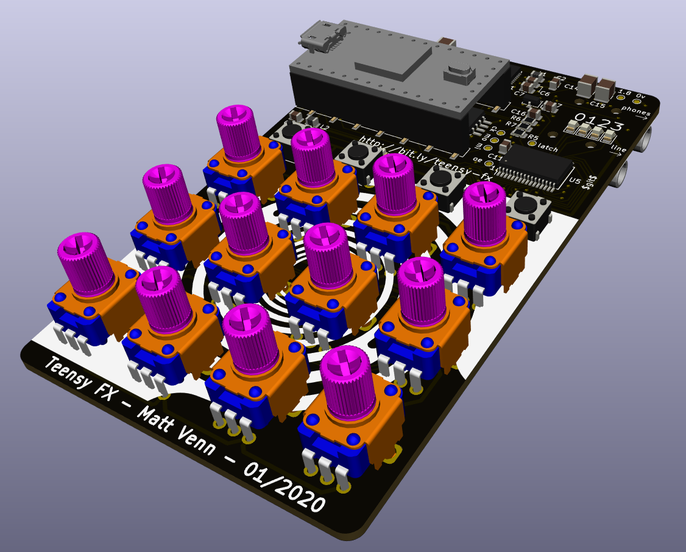

# Teensy FX

* A Teensy 4 based FX box with Pocket Operator style and playability.
* Currently a combination of reverb, ping pong filtered delay and a noise source.
* Playing with settings with [control.py](control.py) as I work on the hardware
* Each knob can be automated (a bit like punch in effects on the Pocket Operators)

# Software

[control.py](control.py) is a PyQT program that was developed in order to make an MVP
interface that could later be translated to hardware in the form of a PCB.

# Hardware

[schematic](hardware/schematic.pdf)

[gerbers](hardware/teensy-fx-2020-02-10-fab.zip)

## Hardware Resources

Based off the teensy 4 audio board and the [teensy beats shield](https://hackaday.io/project/161127-teensy-beats-shield)

* teensy 4 audio board schematic https://www.pjrc.com/store/schematic_audio4.png
* [SGTL5000 datasheet](https://static6.arrow.com/aropdfconversion/d5e3ddfdb01ac7d0ee29dd23626c23e0eb18a14a/1931605559406471sgtl5000.pdf)
* TLC5947 24 channel PWM LED driver
* 4067 multiplexer for the knobs
* pot RK09K1130AP5

## Hardware todo

* print and check footprints
 * regulator fp - done
 * smt sockets for teensy - done
 * pots - done RS
 * 4067 - done
 * tlc5947 - done
 * sgtl5000 - done
* test some parts? or at least check on the scope the pins are wiggling while fx are happening
* add up 3.3v & 1.8v current and check < 250ma (leds on 5v supply) - done
    - pots: 4mA
    - audio codec: 5mA
* caps for audio, what parts - done
* extra caps for led driver and led circuit - done
* find suppliers - done
* audio sockets weren't available in EU, changed to 35RASMT2BHNTRX which has 5 pads but will fit on the same fp

## debugging bust audio

* keep posting to https://forum.pjrc.com/threads/58899-quot-pocket-operator-quot-style-teensy-effects-board-design-review
* check chip id is the same
* check wiring of the teensy board (ignore schematic) LRCLK and BCLK were reversed...
* check and understand i2s signals

# HWv2

* test points for mic input
* separate regulator for pot 3.3v to reduce noise?
* put leds and buttons below pots for easier viewing and pressing
* leave space on back for rubber feet
* update FP of audio sockets to new FP
* filter behind pot mux was a mistake. filters must be in front of mux - fixed
* fix LRCLK & BCLK mixup - fixed

## Back graphic

100 x 60mm == 3.94 x 2.36" == 1182 x 708 pix

# FW

Try to fulfil what the [control.py](control.py) program can do.

## Todo

* map button and bar leds
* sw probably need debounce
* pot probably need filter

## Top Level

* each knob controls one of the parameters (see config in control.py)
* each knob has a number of steps of recordable automation (160 in control.py)
* knob's leds brightness shows current value of parameter
* record time is based on bpm tap tempo and number of steps (4 bars in control.py)
* buttons are: tap tempo, record, wipe and start automation loop from beginning
* press record and move a knob to record its movement
* moving a knob without pressing record will wipe the pattern and set it all to the current knob value
* leds for buttons are tempo, if recording, and if wiping
* 4 leds on top right show progression through the bar

## Notes

Problem with knowing when to write or erase knob automation data. In the software, you know
because the handle is clicked. But in hw if you do

for knob in knobs:
    if (button.write && knob.changed)
        set_new_data(knob.value, step)

what happens if you wiggle the knob and then hold it in one place. And if you have

for knob in knobs:
    if (button.write)
        set_new_data(knob.value, step)

Then all knob automation will be overwritten as soon as write button is pressed.

So probably need state machine where writing is started on knob move, and then stopped when write is released

Also, in testing, knob value is fairly noisy and even with filtering in hw and sw still not easy to know if it's changed
while remaining responsive.
